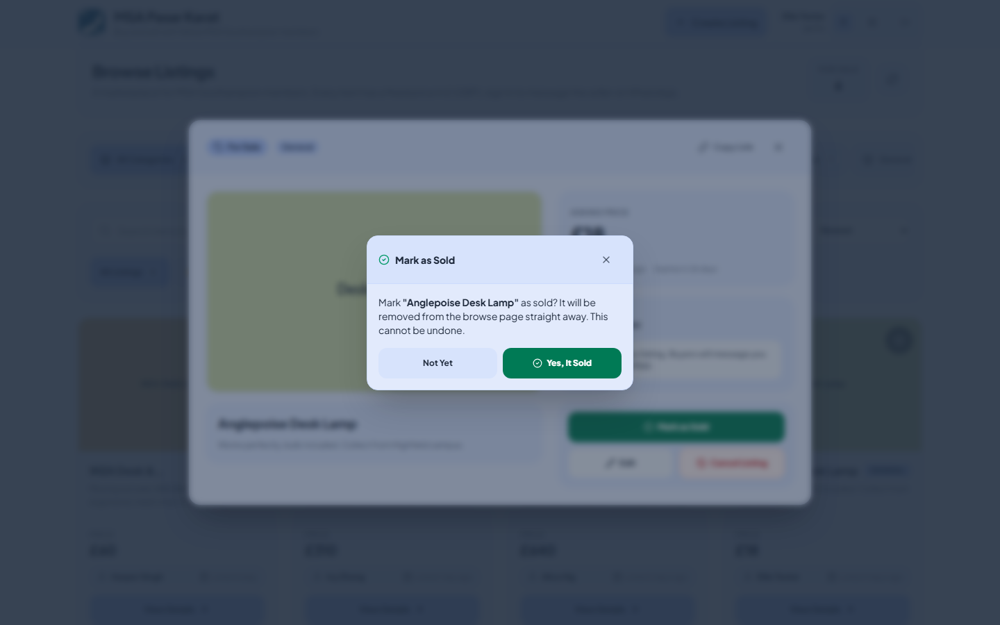

<div align="center">
  

  <h1>MSA Auction</h1>

  <p>A fixed-price classifieds board for MSA Southampton (~300 members), built on React and Cloudflare Workers.</p>

  <p><strong>Live:</strong> <a href="https://msa-auction.msasoton.workers.dev/">https://msa-auction.msasoton.workers.dev/</a></p>
</div>

---

## What it is

Despite the name, this is **not an auction any more**. A member posts an item with one fixed asking
price, buyers browse and message the seller on WhatsApp to arrange the sale, and the seller marks
the listing **Sold** once it's gone. There is no bidding, no settlement and no winner — the table
is still called `auctions` in the database purely to limit code churn.

A listing stays on the browse page until one of three things happens: the seller marks it sold, the
seller cancels it, or `LISTING_TTL_DAYS` days pass since it was created (default 30, configurable in
`wrangler.toml`). `expired` is never stored — it's derived at read time from `expires_at`.

## Features

**Browsing**

- A browse grid of live listings, newest first, paginated with a **Load More** button (24 per page, keyset pagination via an opaque cursor).
- Cards carry no image data — `GET /api/auctions` returns only an `imageCount`; `GET /api/auctions/:id/images` (cached 5 minutes) fetches the first image of each card as it scrolls into view, and all images when the listing is opened.
- Search across title, description, category and seller name; filter by category; sort by newest, price low-to-high or price high-to-low. Filtering and sorting are **client-side**, over whatever pages are currently loaded.
- Every listing has its own URL (`/auction/:id`). The Worker injects that listing's Open Graph tags (fixed price + derived status) into the page shell, so a shared link previews with the item's title, price and status.
- A deep link to a listing that no longer exists (deleted, hidden, or never existed) shows a clear "no longer available" notice rather than a blank page.
- Per-device watchlist stored in browser `localStorage`. Not synced to your account.
- All prices are GBP (£), formatted with `en-GB`.

**Accounts**

- Username/password accounts with an optional recovery email. The session token is kept in `localStorage`.
- Passwords are hashed with PBKDF2-HMAC-SHA256 (10,000 rounds — see Known limitations) and a per-user salt. Accounts created before this still verify against the old unsalted SHA-256 digest and are silently rewritten to PBKDF2 on the next successful sign-in.
- Password reset by single-use token, valid for 60 minutes. Only the SHA-256 hash of the token is ever stored, and nothing is emailed — see Known limitations.
- **My Account** (`/account`) lists everything you've posted, split into Active and Past.

**Selling and moderation**

- Create a listing with a title, description, contact phone number, fixed price, category and up to 3 images. Images are compressed in the browser (target ≤1024px on the long edge, JPEG, roughly 100-150KB each) before upload.
- The seller's WhatsApp/phone number is only shown to **signed-in** visitors — an anonymous visitor viewing a listing cannot harvest it.
- A seller can **edit** a live listing at any time, **mark it Sold**, or **cancel** it. Cancelling and marking sold are both soft actions: the listing leaves the browse page but stays reachable by its own link.
- Any signed-in user other than the seller can **report** a listing to the committee.
- Admin panel at `/admin`: the report queue, hide a listing (with a reason, closing any open reports on it), ban/unban an account, and read pending password-reset links to pass on by hand.
- Per-seller cap on **live** listings (active and not yet expired), configurable via `MAX_LISTINGS_PER_USER` (default 20). Selling or withdrawing a listing frees a slot.

---

## How to use — tutorial

### 1. Browse listings

Open the site and you land on the browse grid. Each card shows the item photo, its asking price and category. If there are more listings than fit on the first page, a **Load More** button appears below the grid.


### 2. Create an account or sign in

Click **Sign In** in the header. The modal has two tabs: Sign In and Register (name, username, email — optional, password). Usernames are stored lower-case and must be unique.


### 3. List an item for sale

Press **Create Listing** in the header (you'll be prompted to sign in first if you aren't). Fill in a title, description, price, contact phone number (with country code — it's what the WhatsApp button is built from), a category, and 1-3 photos.


### 4. Open a listing and contact the seller

Click a card to see the full description, photo gallery, and the seller's name with a **Message the Seller on WhatsApp** button (shown once you're signed in). **Copy Link** in the header copies the listing's own URL — it opens straight onto that listing for anyone, and a link preview shows the item's title and price.


### 5. Mark your own listing as sold

Open one of your own listings (from the grid or **My Account**) and press **Mark as Sold**. It asks for confirmation — this can't be undone, and the listing leaves the browse page immediately.



### 6. Search, filter and sort

Use the search box to match on title, description, category or seller name, the category chips to filter, and the sort dropdown for newest / price low-to-high / price high-to-low. These apply to whatever has already loaded — press **Load More** first if you expect more results.


### 7. Your listings

Go to **My Account**. Every listing you've posted is split into **Active** and **Past**; an active one has **Mark as Sold**, **Edit** and **Cancel** controls.

### 8. Report a listing

Open any listing you didn't post and press **Report**. Pick a reason (scam, prohibited item, offensive content, wrong category, or other) and add optional detail. Reporting the same listing twice while your first report is still open quietly returns the report you already filed rather than erroring.

### 9. Forgotten password

On the sign-in tab, press **Forgot password?** and enter your username or email. The site always answers the same generic way, whether or not the account exists. **No email will arrive** — there's no mail provider wired up. Message an MSA committee member; they read your reset link from the admin panel and pass it to you. It lasts 60 minutes from the moment they read it and works only once.

### Tips

- The browse feed refreshes automatically about once a minute while the tab is visible, and immediately when you switch back to the tab. There is no other live polling — no health check, no per-listing refresh.
- Screenshots above are generated by `tests/e2e/screenshots.spec.ts`, via `npm run screenshots`.

---

## Tech stack

| Layer | Technology |
| --- | --- |
| Frontend | React 19, TypeScript 5.8, Vite 6 |
| Routing | `react-router-dom` 7 (`/`, `/auction/:id`, `/account`, `/admin`, `/reset-password`) |
| Styling | Tailwind CSS 4 (`@tailwindcss/vite`) |
| Icons | `lucide-react` |
| Backend | Cloudflare Workers (`workers/index.ts` + `workers/shared.ts`) |
| Scheduled work | One Cloudflare cron trigger, `crons = ["0 3 * * *"]` — daily stale-image cleanup only |
| Database | Supabase (Postgres) via `@supabase/supabase-js` |
| Tests | Vitest, React Testing Library, Playwright |

### Scripts

| Script | What it does |
| --- | --- |
| `npm run dev` | Vite dev server on port 5173, proxying `/api` and `/images` to `http://127.0.0.1:8787` |
| `npm run dev:api` | `wrangler dev` — runs the actual Worker locally, reading secrets from `.dev.vars` |
| `npm run build` | `vite build` — builds the client into `dist/`. Nothing else; there is no separate server bundle |
| `npm run preview` | Vite preview of the built client |
| `npm run lint` | `tsc --noEmit` type-check |
| `npm test` | Vitest unit and component tests, once |
| `npm run test:watch` | Vitest in watch mode |
| `npm run test:coverage` | Vitest with a coverage report |
| `npm run test:e2e` | Playwright end-to-end tests (excludes the screenshot spec) |
| `npm run screenshots` | Playwright, running only `tests/e2e/screenshots.spec.ts`, to regenerate `docs/images/*.png` |

Run both `npm run dev` and `npm run dev:api` together for local development — Vite serves the client and proxies API/image requests to the Worker running under `wrangler dev`.

---

## Architecture

**`workers/index.ts`** — the Worker's `fetch` handler. Serves the built static client from `./dist` for non-`/api/` routes, exposes the REST API below, and injects Open Graph tags into `/auction/:id` requests. It also exports a `scheduled` handler for the one cron trigger.

**`workers/shared.ts`** — all the logic: listing status derivation, validation, password hashing and reset, moderation (reports, hide, ban), the browse-list cursor query, the Open Graph tag builder, and the stale-image cleanup sweep. Runtime-agnostic (no Node built-ins), with the Supabase client always passed in, so the unit tests can drive it against an in-memory fake.

There is no separate dev server any more — `npm run dev:api` runs the real Worker via `wrangler dev`, so local development exercises the same code path as production.

### Image storage

Listing images are **base64 `data:` URLs stored in `auctions.image_urls`**. The Cloudflare R2 path (`POST /api/images` → an `/images/<uuid>.<ext>` reference → `GET /images/:key`) is fully implemented and tested, but the `[[r2_buckets]]` binding in `wrangler.toml` is commented out — see Known limitations.

### API routes

Cross-checked against every route branch in `workers/index.ts`. "Auth" is what the route requires: **none**, **bearer** (`Authorization: Bearer <token>`), or **admin** (a bearer token whose user row has `role = 'admin'`).

| Method | Route | Auth | Purpose |
| --- | --- | --- | --- |
| `OPTIONS` | any | none | CORS preflight; answers `204` |
| `GET` | `/images/:key` | none | Serve an R2 object. **Currently answers `404`** — no bucket is bound, so no key was ever minted |
| `GET` | `/auction/:id` | none | The SPA shell with that listing's Open Graph tags injected. Falls back to the plain shell for an unknown or hidden listing |
| *(any)* | *(any other non-`/api/` path)* | none | Static assets from `./dist` |
| `GET` | `/api/health` | none | Health ping |
| `POST` | `/api/images` | bearer | Upload raw image bytes to R2. **Currently answers `503 IMAGE_STORAGE_UNAVAILABLE`** — the client falls back to inlining the image as a `data:` URL |
| `POST` | `/api/auth/register` | none | Create an account (email optional) |
| `POST` | `/api/auth/login` | none | Sign in; issues a bearer token. Accepts legacy SHA-256 password hashes and upgrades them to PBKDF2 |
| `GET` | `/api/auth/me` | bearer | Resolve the current user from the token |
| `POST` | `/api/auth/email` | bearer | Attach or change the caller's recovery email |
| `POST` | `/api/auth/request-reset` | none | Create a password-reset token. Always answers the same generic `200`; never returns the token |
| `POST` | `/api/auth/reset-password` | none | Consume a reset token, set a new password, mint a new session token (signs out every other session) |
| `GET` | `/api/auctions` | none | One keyset page of **live** listings — `{ auctions, nextCursor }`. Takes `limit` (default 24, max 60) and `cursor`. No image data, only `imageCount` |
| `GET` | `/api/auctions/:id/images` | none | The listing's image URLs, cached 5 minutes. `404` for a hidden listing unless the caller is an admin |
| `GET` | `/api/auctions/:id` | none | One listing. Any non-hidden listing, whatever its status — `status` (with `expired` derived) tells the client. `phoneNumber` only for a signed-in caller |
| `PATCH` | `/api/auctions/:id` | bearer | Edit a listing. Seller only, and only while it's live (`409` with the specific reason otherwise) |
| `POST` | `/api/auctions/:id/sold` | bearer | Mark a listing sold. Seller only, live only |
| `DELETE` | `/api/auctions/:id` | bearer | Soft-cancel a listing to `status = 'cancelled'`. Seller only, live only |
| `POST` | `/api/auctions` | bearer | Create a listing. Enforces `MAX_LISTINGS_PER_USER` against **live** listings only (`429` when reached) |
| `POST` | `/api/auctions/:id/report` | bearer | Report a listing. A duplicate open report is a `200` with `duplicate: true`, not an error |
| `GET` | `/api/users/me/activity` | bearer | The caller's own listings, every status, newest first, capped at 200 |
| `GET` | `/api/admin/reports` | admin | The report queue, open reports first |
| `POST` | `/api/admin/migrate-images` | admin | Run one batch of the base64 → R2 backfill. **Currently answers `503`** — nothing to migrate into |
| `GET` | `/api/admin/reset-requests` | admin | Pending password-reset links. **Reading this re-issues every token**, invalidating any link handed out earlier and restarting the 60-minute window |
| `POST` | `/api/admin/auctions/:id/hide` | admin | Soft takedown to `status = 'hidden'`. Requires a reason; closes any open reports on the listing as `actioned` |
| `POST` | `/api/admin/users/:id/ban` | admin | Ban an account. Requires a reason. You cannot ban yourself, and admin accounts cannot be banned |
| `POST` | `/api/admin/users/:id/unban` | admin | Lift a ban |
| *(any)* | *(anything else under `/api/`)* | none | `404 NOT_FOUND` |

Errors come back as `{ error, code }`, where `error` also carries the code as a ` [Code: SOME_CODE]` suffix; the client reads `code` and strips the suffix before showing the message. A banned account is refused at authentication, so every `bearer`/`admin` route above answers `403 ACCOUNT_BANNED` at once.

### Live updates

The Worker is REST-only. The client polls the browse feed (`src/lib/realtime.ts`): once every 60 seconds while the tab is visible, paused while hidden, and refreshed immediately when the tab regains focus or visibility (throttled to at most once per 30 seconds for that trigger). There is no health poll and no per-listing detail poll — a listing you have open only updates the next time you reopen it or reload.

---

## Getting started

### Prerequisites

- Node.js 18 or newer
- npm
- A Supabase project (URL and a secret key)

### 1. Install dependencies

```bash
npm ci
```

### 2. Configure environment variables

Copy `.env.example` to `.dev.vars` (used by `wrangler dev`) and fill in real values:

```bash
cp .env.example .dev.vars
```

```
SUPABASE_URL="https://your-project.supabase.co"
SUPABASE_SECRET_KEY="your-secret-key"
```

`.dev.vars` is git-ignored. `VITE_API_BASE_URL` only matters if the client and API are ever hosted on different origins — leave it empty for local dev and for the deployed Worker, where they share one.

**How secrets are configured.** `wrangler.toml`'s `[vars]` block holds plaintext configuration only (`SUPABASE_URL`, `MAX_LISTINGS_PER_USER`, `LISTING_TTL_DAYS`, `ENABLE_STALE_IMAGE_CLEANUP`) and is committed to the repo. The Supabase secret key bypasses row-level security, so it is never put there — locally it goes in `.dev.vars`; in production it's set as a Worker secret through the **Cloudflare dashboard** (see `DEPLOY.md`). The Worker reads `env.SUPABASE_SECRET_KEY ?? env.SUPABASE_SERVICE_ROLE_KEY`, so an older deployment using the legacy name still works.

### 3. Set up the database

Run the migrations in `migrations/`, in order, via the Supabase dashboard's SQL Editor. See [DEPLOY.md](DEPLOY.md).

### 4. Run the app

```bash
npm run dev
```

in one terminal, and

```bash
npm run dev:api
```

in another. Vite serves the client on `http://localhost:5173` and proxies `/api` and `/images` to the Worker running under `wrangler dev` on port 8787.

---

## Environment variables and settings

| Name | Where | Purpose |
| --- | --- | --- |
| `SUPABASE_URL` | `wrangler.toml` `[vars]` (plaintext) | The Supabase project URL |
| `SUPABASE_SECRET_KEY` | Worker secret (dashboard) / `.dev.vars` locally | Bypasses row-level security — never in `[vars]`. Legacy name `SUPABASE_SERVICE_ROLE_KEY` is still read as a fallback |
| `MAX_LISTINGS_PER_USER` | `wrangler.toml` `[vars]` | Cap on a seller's **live** listings. Default `20` if unset |
| `LISTING_TTL_DAYS` | `wrangler.toml` `[vars]` | How many days a new listing stays live before it expires on its own. Whole number 1-365; anything else falls back to `30`. Set once, at creation — editing a listing never extends it |
| `ENABLE_STALE_IMAGE_CLEANUP` | `wrangler.toml` `[vars]` | Only the literal string `"true"` enables the daily photo-deletion sweep. Anything else (including unset) is off |
| `VITE_API_BASE_URL` | `.env` (build-time, client) | Set only when the client is served from a different origin than the API. Empty for both local dev and the deployed Worker |

---

## Database schema

Two tables, `users` and `auctions`, plus `reports` (added by migration 003). Column names are snake_case and `workers/index.ts`/`workers/shared.ts` read and write those exact names. Timestamps are epoch **milliseconds** stored as `bigint`, not `timestamptz`.

**`migrations/` is the source of truth**, applied in order via the Supabase SQL Editor:

| Migration | What it adds |
| --- | --- |
| `001_listing_lifecycle_and_list_payload.sql` | `auctions.image_count` (a stored generated column over `image_urls`), a keyset-pagination index, and a partial index for the per-seller listing cap |
| `002_user_email_and_password_reset.sql` | `users.email` (case-insensitive unique), plus `reset_token_hash` / `reset_token_expires` for password recovery |
| `003_moderation_and_admin.sql` | `users.role` (default `'member'`), `banned_at` / `banned_reason`; the `reports` table; `auctions.hidden_reason` / `hidden_by` / `hidden_at` |
| `004_money_numeric_and_bid_version.sql` | Converts the money columns from `double precision` to `numeric(12,2)`, and adds `bid_version` (a bid-era column no longer used by this Worker, retained until migration 007) |
| `005_enable_rls.sql` | Turns on row level security on `users`, `auctions`, `reports`. No policies added — the Worker always authenticates with the secret key, which bypasses RLS |
| `006_fixed_price_listings.sql` | **Additive.** Adds `auctions.price`, `expires_at`, `sold_at`; backfills every existing row; adds the browse/seller indexes this Worker's queries use; installs a transitional trigger so the pre-v1 Worker's writes stay compatible until cutover. See the file's own header for the full backfill rules |
| `007_drop_bid_columns.sql` | **Destructive, irreversible.** Drops `bids`, `bid_version`, `current_price`, `starting_price`, `highest_bidder_id`/`name`, `winner_id`/`name`, `winning_bid`, `duration_minutes`, `start_time`, `end_time`; tightens the `status` CHECK to `active | sold | cancelled | hidden`; drops 006's transitional trigger. Read its header — it requires a manual backup step first and must only run **after** the v1 Worker is deployed |

`auctions.status` holds `active`, `sold`, `cancelled` or `hidden`. `expired` is never stored — it's derived from `status = 'active' AND expires_at <= now`.

**You must appoint the first admin by hand** — there is deliberately no route that grants admin. See `DEPLOY.md`.

---

## Testing

```bash
npm test              # unit and component tests, once
npm run test:watch    # re-run on file changes
npm run test:coverage # with a coverage report
npm run test:e2e      # Playwright end-to-end tests
npm run screenshots   # regenerate docs/images/*.png (not part of test:e2e)
```

- **Unit tests** (`tests/unit`) exercise the Worker's own `fetch` handler and the shared helpers — listing lifecycle and validation, moderation, image handling, the stale-image cleanup sweep, auth and password reset — against an in-memory fake of the Supabase query builder (`tests/unit/helpers/fake-supabase.ts`) and a fake R2 bucket (`fake-r2.ts`).
- **Component tests** (`tests/components`) use Vitest with React Testing Library, covering the modals, views and header.
- **End-to-end tests** (`tests/e2e/listing-flow.spec.ts`, 13 tests) use Playwright against the Vite dev server with the API mocked at the network layer (`tests/e2e/fixtures/mockApi.ts`), so they never touch production data or the live Supabase project. `screenshots.spec.ts` is excluded from the default `test:e2e` run and only runs via `npm run screenshots`.

---

## Deployment

The site runs as a Cloudflare Worker: `wrangler.toml` points `main` at `./workers/index.ts` and serves static assets from `./dist`. **Deploys go through the Cloudflare dashboard's Git-connected build**, triggered by a merge to `main` — never a local `wrangler deploy`.

Full deployment steps, and the v1 cut-over runbook, are in **[DEPLOY.md](DEPLOY.md)**.

---

## Known limitations

- **Cloudflare R2 object storage is implemented but switched off.** `POST /api/images`, `GET /images/:key`, and the admin backfill route all exist and are tested, but the `[[r2_buckets]]` block in `wrangler.toml` is commented out: enabling R2 requires a payment method on the Cloudflare account, and this is a university society's project, not anyone's personal one — no card on file, on principle. With no binding, the Worker degrades rather than erroring: `POST /api/images` answers `503 IMAGE_STORAGE_UNAVAILABLE`, which the client takes as its cue to store the image inline as a `data:` URL instead, exactly as it always has. The validator accepts both forms in any mixture, so switching R2 on later needs no code change — see Appendix A of `DEPLOY.md`.
- **No mail provider is configured**, so password-reset links are never emailed. `POST /api/auth/request-reset` creates a token, but a committee member has to read it from `GET /api/admin/reset-requests` and pass the link to the student by hand. Because only the token's hash is stored, that read *re-mints* every pending token — any link handed out from an earlier read stops working, and the 60-minute window restarts. This route is an interim measure and should be deleted once a mail provider exists.
- **The watchlist is device-local.** It's a single `localStorage` key, so two accounts sharing one browser share one watchlist, and it never follows you to another device.
- **Filtering and sorting are client-side**, over whatever pages have already been loaded into the grid. A filter will not find a listing still behind **Load More**.
- **PBKDF2 is set to 10,000 iterations**, below general guidance. This is a deliberate trade-off: at 100,000 rounds a single derivation exceeds Cloudflare's free-tier 10ms CPU cap and breaks login/registration. These accounts only gate editing your own listing and guard no sensitive data, so a lower iteration count was judged an acceptable trade for staying on the free tier. The iteration count is embedded in each stored hash, so raising it later needs no migration.
- **Every test runs against an in-memory Supabase fake or a mocked network**, never real Postgres — schema drift and PostgREST serialisation quirks are not covered by the automated suite.

---

Built by [dragonfisher29](https://github.com/dragonfisher29) for MSA Southampton.
