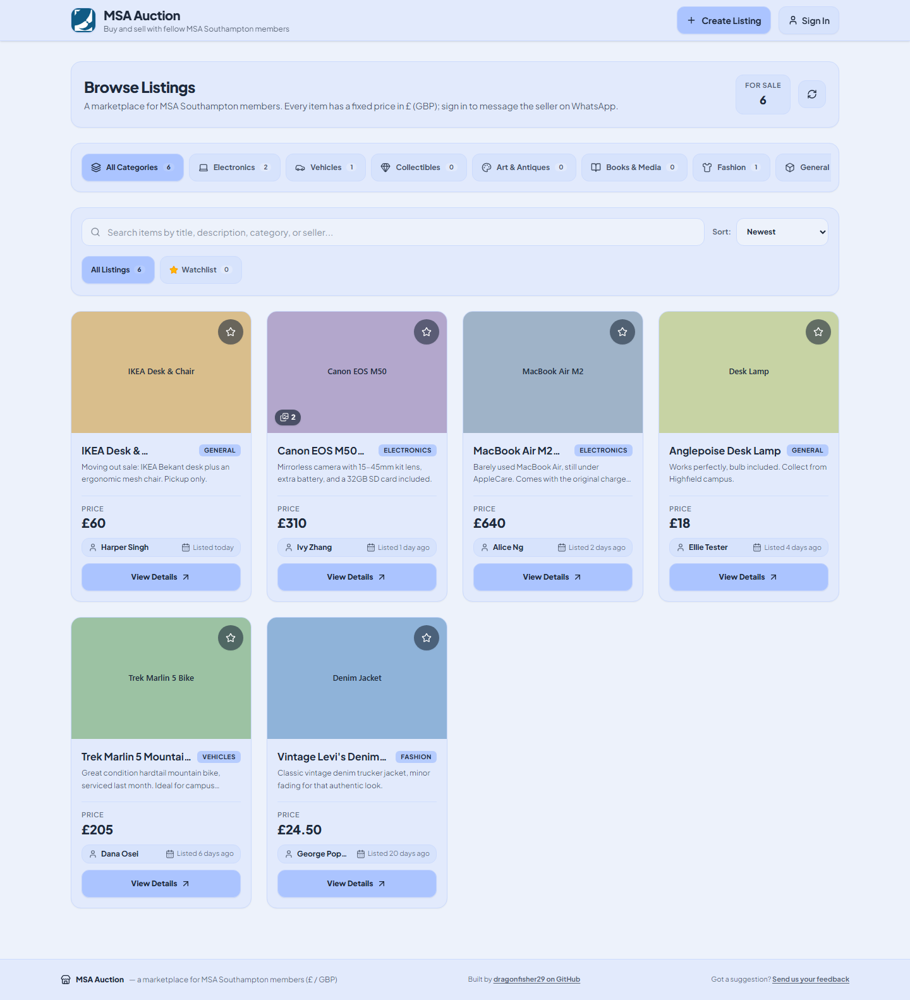
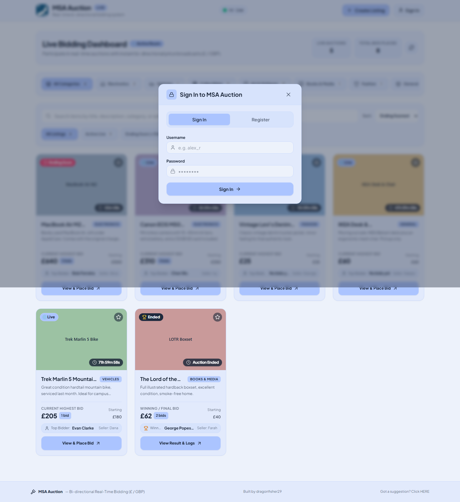
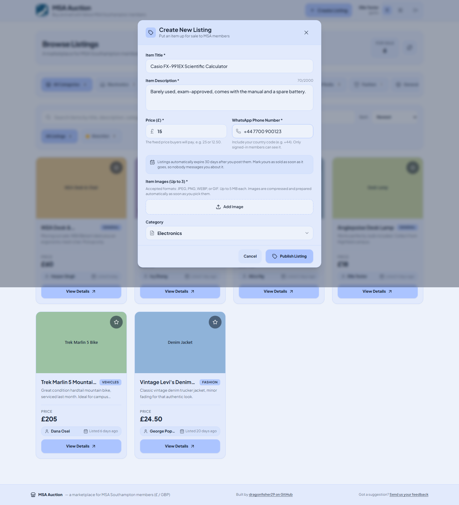
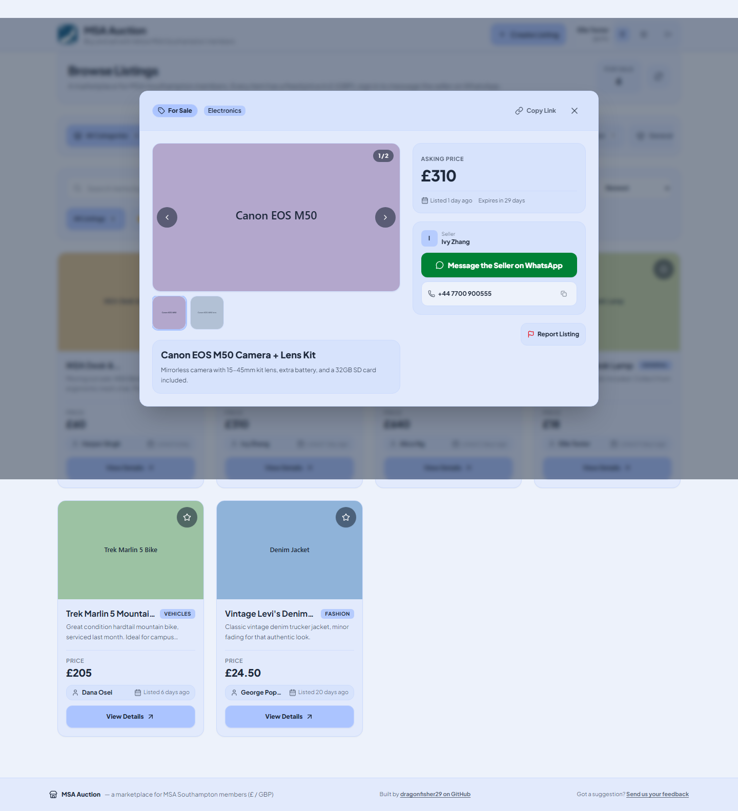
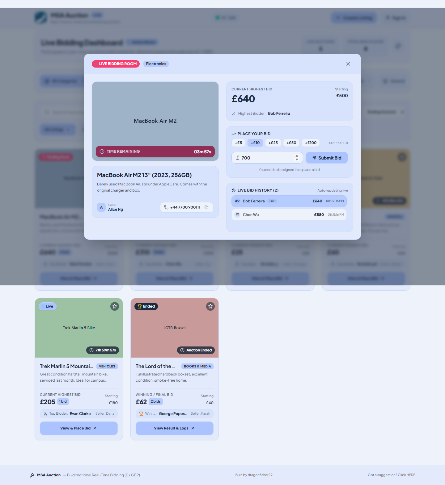
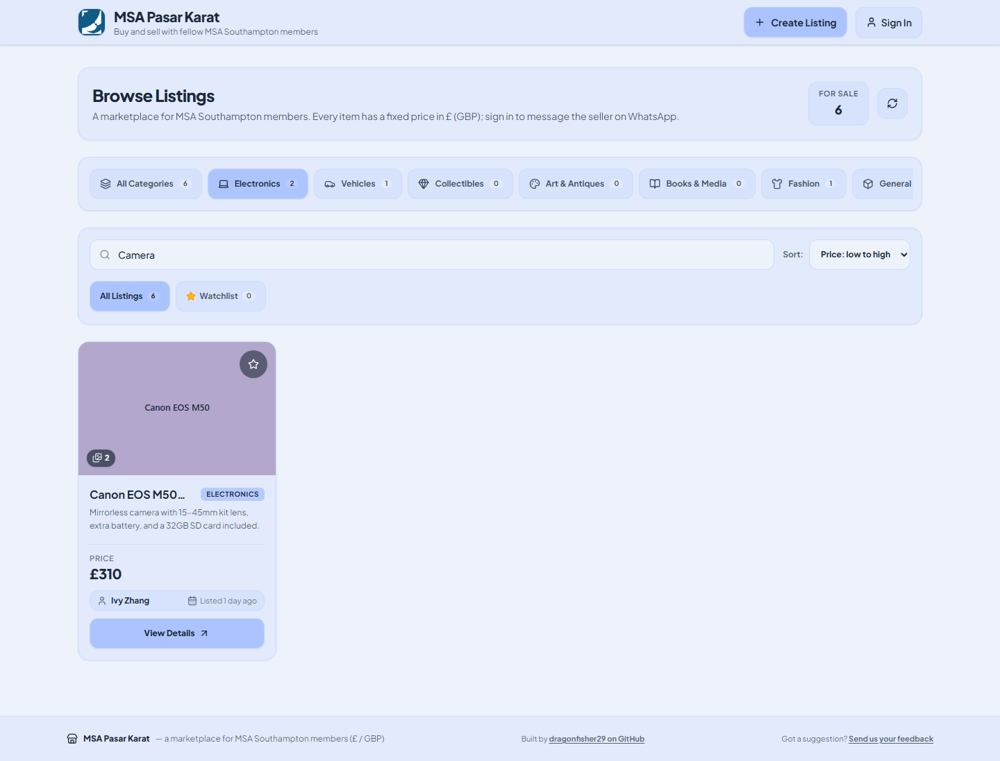

<div align="center">
  

  <h1>MSA Auction</h1>

  <p>A real-time student auction and marketplace for MSA Southampton, built on React and Cloudflare Workers.</p>

  <p><strong>Live:</strong> <a href="https://msa-auction.msasoton.workers.dev/">https://msa-auction.msasoton.workers.dev/</a></p>
</div>

---

## Features

**Browsing and bidding**

- Auction grid with a per-second countdown on every card, badged **Live**, **Ending Soon** (under 5 minutes left) or **Ended**. No account needed to look around.
- The list is paginated: 24 listings per page, with a **Load More Auctions** button that appends the next page rather than replacing the grid.
- Cards carry no image data. `GET /api/auctions` returns only an `imageCount`; each card fetches its photos from `GET /api/auctions/:id/images` once it comes near the viewport (IntersectionObserver), and the result is cached in memory for the rest of the session.
- Bidding with server-side validation, quick `+£5 / +£10 / +£25 / +£50 / +£100` increment pills, and a live bid history log.
- Search across title, description, category and seller name; filter by category and status; sort by end time, price or bid count. **All of these live in the URL query string**, so a filtered view is shareable and survives a reload.
- Every auction has its own URL (`/auction/:id`). Opening one is a real navigation — the browser's back button closes it, and the link can be copied and shared. The Worker injects that listing's Open Graph tags into the page shell, so a shared link previews with the item title, price and status.
- Per-device watchlist stored in browser `localStorage` (`msa_watchlist_ids`). Not synced to your account.
- All prices are GBP (£), formatted with `en-GB`.

**Accounts**

- Username/password accounts with an **optional** email address. The session token is kept in `localStorage` (`msa_auction_user`).
- Passwords are hashed with PBKDF2-HMAC-SHA256 and a per-user salt, stored as `pbkdf2$<iterations>$<salt>$<hash>`. Accounts created before this still verify against the old unsalted SHA-256 digest and are silently rewritten to PBKDF2 on the next successful sign-in.
- Password reset by single-use token, valid for 60 minutes. Only the SHA-256 hash of the token is ever stored.
- **My Account** (`/account`) shows My Listings, My Bids and My Wins. A won item shows the seller's phone number and a WhatsApp button so you can arrange handover.
- A notification bell (outbid / won / lost / sold), polled every 15 seconds. Read state is per-user and kept in `localStorage`.

**Selling and moderation**

- Create listings with a title, description, contact phone number, starting price, duration, category and up to 3 images. Images are compressed in the browser (max 1600px on the long edge, 5 MB per file) before upload.
- A seller can **edit** a listing while it has zero bids, and **cancel** it at any time before it ends. Cancelling is a soft withdrawal: the listing leaves the public grid but everyone who bid can still open it by link and see their bid history.
- Any signed-in user (other than the seller) can **report** a listing to the committee.
- Admin panel at `/admin`: the report queue, hide a listing, ban/unban an account, and read pending password-reset links.
- Auctions are settled by a Cloudflare cron trigger that runs once a minute, and again lazily whenever an auction is read. A winner is written to the row.
- Per-user cap on **active** listings, configurable via `MAX_LISTINGS_PER_USER` (default 20). Ending or cancelling a listing frees a slot.

---

## 📖 How to Use — Tutorial

> **A note on the screenshots.** Images `02`, `03`, `04` and `05` below were captured before the most recent round of changes and no longer show everything the UI does. Specifically: the sign-in modal now also has a **Forgot password?** link; the create-listing form's phone field now asks for a country code and the category field is now a dropdown rather than a free-text box; and the auction detail view now has a **Copy Link** button in its header, a **WhatsApp** contact button, and a **Report Listing** button for signed-in viewers. Images `01` and `06` still match, but both are signed-out views — they do not show the notification bell, account or admin buttons that appear in the header once you sign in. The screenshots are generated by `tests/e2e/screenshots.spec.ts`, so `npm run test:e2e` regenerates them.

### 1. Browse live auctions

Open the site and you land on the **Live Bidding Dashboard**. Each card shows the item photo, a live countdown, the current highest bid, the starting price, the number of bids, the top bidder and the seller's first name. Cards with more than one photo show a small counter in the corner. If there are more listings than fit on the first page, a **Load More Auctions** button appears below the grid.



### 2. Create an account or sign in

Click **Sign In** in the top-right of the header. The modal has two tabs: **Sign In** (Username, Password) and **Register** (Full Name, Username, Email — optional, Password). Usernames are stored lower-case and must be unique — registering a name that is taken returns "Username is already taken. Please choose another."

**Add the email.** It is optional, but it is the only thing that makes a forgotten password recoverable on your own. If you skip it, the account page will prompt you once to add one later; you can dismiss the prompt.

Once you are in, the header shows your name, `@username`, a notification bell, a **My account** button and a sign-out button.



### 3. List an item for sale

Press **Create Listing** in the header (you must be signed in; otherwise the modal prompts you to sign in first). Fill in:

- **Item Title**, **Item Description**, **Starting Price (£)**
- **Contact Phone Number** — include the country code, e.g. `+44 7700 900123`. A number starting with a single `0` is rejected, because the WhatsApp contact button is built from this value and cannot guess your country.
- **Auction Duration** — 2 Mins, 5 Mins, 6 Hours, 24 Hours, 3 Days, 7 Days, or a custom number of minutes.
- **Item Images** — at least one, up to 3, via **Add Image**.
- **Category** — a dropdown: Electronics, Vehicles, Collectibles, Art & Antiques, Books & Media, Fashion, General.

Submitting with a missing field shows "Please complete the title, description, and phone number fields.", and with no image "Please upload at least one image before publishing the listing." Click **Publish Live Auction** and the countdown starts immediately.



### 4. Open an auction, share it, and see the bid history

Click **View & Place Bid** on any card (ended auctions read **View Result & Logs**). The detail view shows the photo gallery (arrows, thumbnails, arrow keys and swipe), the full description, the current highest bid against the starting price, the current top bidder, and a **Live Bid History** log with every bid, bidder name, amount and timestamp, newest first.

The seller's name and phone number are shown here with a copy button, a `tel:` link and — when the number includes a country code — a **WhatsApp** button. That is how you arrange handover once the auction closes.

**Copy Link** in the modal header copies that auction's own URL (`/auction/<id>`). Paste it anywhere: it opens straight onto the listing, even for someone who has never used the site, and a link preview will show the item's title and current price.

Once an auction ends, the top of the view names the winner and the winning bid, and shows a **You Won!** badge if it was you.



### 5. Place a bid

In **Place Your Bid**, type an amount or tap the `+£5`, `+£10`, `+£25`, `+£50` or `+£100` pills, then press **Submit Bid**. You must be signed in — the server identifies the bidder from your session token, not from anything the page sends.

The rules are enforced in the browser and again on the server: the **first** bid must be at least the starting price, and every bid after that must be **strictly higher** than the current price — equalling it is rejected with "Bid must be strictly higher than current bid of £X." You cannot bid on your own listing (the form is replaced by "You are the seller of this listing and cannot bid on it."), and once the countdown expires bidding is closed.

A successful bid confirms with "Placed bid of £X!" and everyone else's view updates on the next poll. If two bids land at the same instant, one of them gets "Another bid landed at the same moment. Please try again." — your typed amount is left in the box so retrying is one tap.



### 6. Search, filter and use the watchlist

Use the search box to match on title, description, category or seller name. The category bar filters by **All Categories, Electronics, Vehicles, Collectibles, Art & Antiques, Books & Media, Fashion** and **General**, and the tabs below filter by **All Listings, Active Live, Ending Soon (<15m), Concluded** and **Watchlist**. Sort with **Ending Soonest, Highest Price, Lowest Price** or **Most Bids**.

Filtering and sorting apply to whatever has been loaded into the grid — press **Load More Auctions** if you expect more results than you can see. Every filter is written into the URL, so you can bookmark or share a filtered view.

Tap the star on any card to add it to your watchlist. This is saved in your browser's `localStorage`, so it is per-device and per-browser and is **not** synced to your account.



### 7. Your listings, bids and wins

Click the **My account** button in the header (or go to `/account`). Three sections:

- **My Listings** — everything you have put up. Each active listing has **Edit** and **Cancel Listing** controls.
- **My Bids** — every auction you have bid on, most recently bid first.
- **My Wins** — auctions you won, each with the seller's phone number and a WhatsApp button for arranging handover.

**Edit** reopens the listing form. You can change the title, description, phone number, category, photos and starting price — but **only while the listing has no bids**. Once someone has bid, the Edit button is disabled and explains why: "This listing already has bids and can no longer be edited. You can cancel it instead." The duration cannot be changed at all.

**Cancel Listing** asks for confirmation and cannot be undone. The listing disappears from the public grid, but anyone holding a direct link — including everyone who bid on it — can still open it and see the bid history.

### 8. Notifications

The bell in the header appears once you are signed in and refreshes every 15 seconds. It tells you when you were **outbid**, when you **won**, when an auction you bid on ended **without you**, and when one of your own listings **sold**. Clicking a notification opens that auction.

Notifications are computed from the auctions themselves on every request, so there is nothing to delete. "Read" is remembered in your browser only, per account, and is cleared when you sign out.

### 9. Report a listing

Open any listing you did not post and press **Report Listing**. Pick a reason — Scam or fraud, Prohibited item, Offensive content, Listed in the wrong category, or Something else — and add up to 1000 characters of detail. You must be signed in. Reporting the same listing twice while your first report is still open is not an error; it quietly returns the report you already filed.

### 10. Forgotten password

On the sign-in tab, press **Forgot password?** and enter your username or email. The site always answers the same way — "If that account exists, a reset link has been created" — whether or not the account exists.

**No email will arrive.** There is no mail provider wired up yet, so nothing is sent to your inbox. Message an MSA committee member; they can read your reset link out of the admin panel and pass it to you. A link lasts 60 minutes from the moment they read it, and works only once. Opening it takes you to `/reset-password?token=...`, where setting a new password signs you in immediately and signs you out everywhere else.

### Tips

- The auction list refreshes roughly every 5 seconds and an open auction every 3 seconds, so prices and bid history appear with a short delay rather than instantly.
- Polling **pauses while the tab is in the background** and fires again the moment you switch back. The refresh button beside the dashboard metrics forces an immediate reload.
- Short durations (the 2-minute preset) are handy for testing an end-to-end bid flow without waiting.

---

## Tech Stack

| Layer | Technology |
| --- | --- |
| Frontend | React 19, TypeScript 5.8, Vite 6 |
| Routing | `react-router-dom` 7 (`/`, `/auction/:id`, `/account`, `/admin`, `/reset-password`) |
| Styling | Tailwind CSS 4 (`@tailwindcss/vite`) |
| Icons / animation | `lucide-react`, `motion` |
| Production backend | Cloudflare Workers (`workers/index.ts` + `workers/shared.ts`) |
| Scheduled work | Cloudflare cron trigger, `crons = ["* * * * *"]` |
| Local dev server | Express 4 + `tsx` (`server.ts`) |
| Database | Supabase (Postgres) via `@supabase/supabase-js` |
| Build | `vite build` for the client, `esbuild` for the dev-server bundle |
| Tests | Vitest, React Testing Library, Playwright |

### Scripts

| Script | What it does |
| --- | --- |
| `npm run dev` | Runs `server.ts` with `tsx` — Express plus Vite middleware on port 3000 |
| `npm run build` | Builds the client into `dist/`, then bundles `server.ts` to `dist/server.cjs` |
| `npm run start` | Runs the built Node server (`dist/server.cjs`) |
| `npm run preview` | Vite preview of the built client |
| `npm run lint` | `tsc --noEmit` type-check |
| `npm test` | Vitest unit and component tests (`tests/unit`, `tests/components`) |
| `npm run test:watch` | Vitest in watch mode |
| `npm run test:coverage` | Vitest with a coverage report |
| `npm run test:e2e` | Playwright end-to-end tests, including the documentation screenshots |

---

## Architecture

There are two server files in this repository, and only one of them is used in production.

**`workers/index.ts` — the production backend.** A plain Cloudflare Worker `fetch` handler. It serves the built static client from `./dist` for non-`/api/` routes and exposes the REST API below. It also exports a `scheduled` handler, which the cron trigger in `wrangler.toml` runs once a minute to settle auctions whose `end_time` has passed. Nothing else in production ends an auction.

**`workers/shared.ts` — the logic both servers share.** Settlement, the bid optimistic lock, password hashing and verification, password reset, moderation, the auction list query and cursor, notification and activity derivation, and the Open Graph tag builder all live here. It is deliberately runtime-agnostic — no Node built-ins, no Express, no Socket.IO, and the Supabase client is always passed in — so the Worker and the dev server cannot drift apart.

**`server.ts` — a local-only dev server.** An Express app that mounts Vite in middleware mode and mirrors every one of the Worker's REST routes so `npm run dev` works locally. It still constructs a Socket.IO server, but **nothing in `src/` emits or listens to those events** — that half of the file is dead code kept for reference. It settles ended auctions on a 1-second interval instead of a cron trigger.

### API routes

Every route in `workers/index.ts`. "Auth" is what the route requires: **none**, **bearer** (`Authorization: Bearer <token>`), or **admin** (a bearer token whose user row has `role = 'admin'`).

| Method | Route | Auth | Purpose |
| --- | --- | --- | --- |
| `OPTIONS` | any | none | CORS preflight; answers `204` with the allowed methods and headers |
| `GET` | `/auction/:id` | none | The SPA shell with that auction's Open Graph tags injected, HTML-escaped. Falls back to the plain shell for an unknown or hidden listing |
| *(any)* | *(any other non-`/api/` path)* | none | Static assets from `./dist`; unknown paths fall through to `index.html` |
| `GET` | `/api/health` | none | Health ping; drives the **Live** / **Reconnecting...** badge in the header |
| `POST` | `/api/auth/register` | none | Create an account (email optional). Returns the user and a bearer token |
| `POST` | `/api/auth/login` | none | Sign in; issues a fresh bearer token. Accepts legacy SHA-256 hashes and upgrades them to PBKDF2 |
| `GET` | `/api/auth/me` | bearer | Resolve the current user from the token |
| `POST` | `/api/auth/email` | bearer | Attach or change the caller's recovery email address |
| `POST` | `/api/auth/request-reset` | none | Create a password-reset token. Always answers the same generic `200`, and never returns the token |
| `POST` | `/api/auth/reset-password` | none | Consume a reset token, set a new password, and mint a new session token (signing out every other session) |
| `GET` | `/api/auctions` | none | One keyset page of listings — `{ auctions, nextCursor }`. Takes `limit` (default 24, max 60) and `cursor`. Carries no image data, only `imageCount`. Excludes cancelled and hidden listings |
| `GET` | `/api/auctions/:id` | none | One full auction, including `imageUrls`. Settles it first if its countdown has expired. A hidden listing answers `404` unless the caller is an admin |
| `GET` | `/api/auctions/:id/images` | none | The listing's image URLs, cached for 5 minutes. Hidden listings answer `404` unless the caller is an admin |
| `POST` | `/api/auctions` | bearer | Create a listing. Enforces `MAX_LISTINGS_PER_USER` against **active** listings only (`429` when reached) |
| `PATCH` | `/api/auctions/:id` | bearer | Edit a listing. Seller only, active only, and only while it has **zero bids** (`409 LISTING_HAS_BIDS` otherwise). Duration cannot be changed |
| `DELETE` | `/api/auctions/:id` | bearer | Soft-cancel a listing to `status = 'cancelled'`. Seller only. The row and its bid history are kept |
| `POST` | `/api/auctions/:id/bids` | bearer | Place a bid. The bidder is taken from the token; any id in the body is ignored. Guarded by the `bid_version` optimistic lock with 3 retries, then `409 BID_CONFLICT` |
| `POST` | `/api/auctions/:id/report` | bearer | Report a listing to the committee. A duplicate open report is a `200` with `duplicate: true`, not an error |
| `GET` | `/api/users/me/activity` | bearer | `{ listings, bids, wins }` for the caller |
| `GET` | `/api/notifications` | bearer | Outbid / won / lost / sold notifications, derived from the auction rows. Newest first, capped at 50 |
| `GET` | `/api/admin/reports` | admin | The report queue, open reports first, each carrying the reported listing's title and seller |
| `GET` | `/api/admin/reset-requests` | admin | Pending password-reset links. **Reading this re-issues every token**, invalidating any link handed out earlier and restarting the 60-minute window. Interim route — see Known limitations |
| `POST` | `/api/admin/auctions/:id/hide` | admin | Soft takedown to `status = 'hidden'`. Requires a reason; closes any open reports on the listing as `actioned` |
| `POST` | `/api/admin/users/:id/ban` | admin | Ban an account. Requires a reason. You cannot ban yourself, and admin accounts cannot be banned |
| `POST` | `/api/admin/users/:id/unban` | admin | Lift a ban |
| *(any)* | *(anything else under `/api/`)* | none | `404 NOT_FOUND` |

Errors come back as `{ error, code }`, where `error` also carries the code as a ` [Code: SOME_CODE]` suffix. The client reads `code` and strips the suffix before showing the message.

A banned account is refused at authentication, so every `bearer` and `admin` route above answers `403 ACCOUNT_BANNED` at once. The session token is deliberately left valid so the message is accurate rather than a misleading "session expired".

### Live updates

The Worker is REST-only — there is no WebSocket or Socket.IO endpoint behind it — so the client polls (`src/lib/realtime.ts`). `startPolling()` runs a fetch on an interval, skips a tick while the previous request is in flight, pauses while `document.visibilityState === 'hidden'`, and fires immediately when the tab becomes visible again.

| What | Interval | Notes |
| --- | --- | --- |
| `/api/auctions` (first page) | 5s | Merged into the loaded grid, so pages fetched via **Load More** are left alone. Triggers no image refetches — image data is cached per auction id |
| `/api/auctions/:id` | 3s | Only while an auction detail view is open |
| `/api/notifications` | 15s | Only while signed in |
| `/api/health` | 15s | Drives the header connection badge |

Countdown timers tick locally every second and need no network request.

### Settlement

An auction ends when `settleEndedAuctions()` in `workers/shared.ts` writes `status = 'ended'` plus `winner_id`, `winner_name` and `winning_bid`. The winner is the highest bid; a tie goes to whoever bid first; an auction with no bids ends with null winner columns. Every update is guarded on `status = 'active'`, so two settlers racing cannot both write a winner, and cancelled or hidden listings are never settled.

It runs from three places: the cron trigger once a minute, lazily before `GET /api/auctions`, `GET /api/auctions/:id`, `/api/users/me/activity` and `/api/notifications` (a failure there is logged and never fails the read), and on a 1-second interval in the dev server.

---

## Getting Started

### Prerequisites

- Node.js 18 or newer
- npm
- A Supabase project (URL and service-role key)

### 1. Install dependencies

```bash
npm install
```

### 2. Configure environment variables

Copy `.env.example` to `.env` and fill in real values:

```bash
cp .env.example .env
```

```bash
SUPABASE_URL="https://your-project.supabase.co"
SUPABASE_SERVICE_ROLE_KEY="your-service-role-key"
VITE_API_BASE_URL=""
MAX_LISTINGS_PER_USER="20"
```

`VITE_API_BASE_URL` can stay empty when the client and API share an origin, which is the case both locally and on Workers. Set it only if you host the API on a separate domain.

**How secrets are configured.** `wrangler.toml`'s `[vars]` block holds plaintext configuration only — `SUPABASE_URL` and `MAX_LISTINGS_PER_USER` — and is committed to this repository. The Supabase service-role key bypasses row-level security, so it is never put there. In production it is set as an encrypted Worker secret:

```bash
npx wrangler secret put SUPABASE_SERVICE_ROLE_KEY
```

For local development it goes in `.env` (used by `server.ts`) or `.dev.vars` (used by `wrangler dev`); both are git-ignored. At runtime the secret arrives on the same `env` object as the plaintext vars, so no code change is needed. The Worker reads `env.SUPABASE_SECRET_KEY ?? env.SUPABASE_SERVICE_ROLE_KEY`, so either name works.

### 3. Set up the database

Run the migrations in `migrations/`, in order. See [DEPLOY.md](DEPLOY.md) for how.

### 4. Run the app

```bash
npm run dev
```

This starts the Express dev server on port 3000 with Vite in middleware mode.

---

## Database schema

Two tables, `users` and `auctions`, plus a `reports` table added by migration 003. Column names are snake_case, and both `workers/index.ts` and `server.ts` read and write those exact names. Timestamps are epoch **milliseconds** stored as `bigint`, not `timestamptz`.

**`migrations/` is the source of truth.** Four files, which must be applied in order:

| Migration | What it adds |
| --- | --- |
| `001_listing_lifecycle_and_list_payload.sql` | `auctions.image_count` (a stored generated column over `image_urls`), the keyset-pagination index `(end_time desc, id desc)`, and a partial index on `(seller_id) where status = 'active'` for the listing cap. Also introduces the `'cancelled'` status value |
| `002_user_email_and_password_reset.sql` | `users.email` with a case-insensitive unique index, plus `users.reset_token_hash` and `users.reset_token_expires` and their lookup indexes |
| `003_moderation_and_admin.sql` | `users.role` (default `'member'`), `users.banned_at`, `users.banned_reason`; the `reports` table; `auctions.hidden_reason` / `hidden_by` / `hidden_at`; and a list index matching the new visibility filter |
| `004_money_numeric_and_bid_version.sql` | Converts `current_price`, `starting_price` and `winning_bid` from `double precision` to `numeric(12,2)`, and adds `auctions.bid_version` — the integer the bid optimistic lock guards on |

Notes worth knowing before you touch the schema:

- `auctions.status` is plain `text` with no CHECK constraint, and holds one of `active`, `ended`, `cancelled`, `hidden`. `cancelled` is a seller withdrawal, `hidden` is an admin takedown; both are excluded from the public list and from settlement, and both stay fetchable by id.
- Migrations 001–003 are purely additive and safe to re-run. 004 rewrites the table and takes an ACCESS EXCLUSIVE lock — run it in a quiet moment.
- PostgREST serialises a Postgres `numeric` as a JSON **string**, so after 004 the money columns arrive as `"400.00"`. They are coerced back to numbers at the row-mapping boundary; nothing in `src/` sees a raw row.
- **You must appoint the first admin by hand.** Everything defaults to `'member'`, and there is no route that grants admin — deliberately. Migration 003 ends with the `UPDATE` to run, commented out.

---

## Testing

```bash
npm test              # run unit and component tests once
npm run test:watch    # re-run on file changes
npm run test:coverage # with a coverage report
npm run test:e2e      # Playwright end-to-end tests
```

- **Unit tests** (`tests/unit`) exercise the Worker's own `fetch` handler and the shared helpers — auth, bids and the optimistic lock, listing lifecycle, moderation, settlement — against an in-memory fake of the Supabase query builder (`tests/unit/helpers/fake-supabase.ts`).
- **Component tests** (`tests/components`) use Vitest with React Testing Library.
- **End-to-end tests** (`tests/e2e`) use Playwright against the Vite dev server with the API mocked at the network layer, so they never touch production data or the live Supabase project. `screenshots.spec.ts` regenerates the tutorial images in `docs/images/`.

---

## Deployment

The site runs as a Cloudflare Worker: `wrangler.toml` points `main` at `./workers/index.ts` and serves static assets from `./dist`, with `not_found_handling = "single-page-application"`. The cron trigger and observability are configured there too.

Full deployment and migration steps are in **[DEPLOY.md](DEPLOY.md)**. Read it before your first deploy — the migrations have a required order and must be applied before the Worker ships.

---

## Known limitations

- **No mail provider is configured.** `POST /api/auth/request-reset` creates a reset token but nothing sends it. A committee member has to read it from `GET /api/admin/reset-requests` (the admin panel's *Pending Password Resets* section) and pass the link to the student by hand. Because only the token's hash is stored, that read *re-mints* every pending token: any link handed out from an earlier read stops working, and the 60-minute window restarts. That route is an interim measure and should be deleted once email exists.
- **An account with no email cannot be recovered at all.** `createPasswordResetRequest` does nothing for a row with a null email. Most accounts predate the email column, which is why the account page prompts for one.
- **Images are base64 data URLs in Postgres**, not object storage. Three consequences: auction rows are large, which is why the list endpoint ships `imageCount` instead of image data; a listing's `og:image` is a `data:` URI, so **shared-link previews show the title and price but no picture**; and the images endpoint is the heaviest response the API serves.
- **PBKDF2 is set to 10,000 iterations**, below general guidance. This is a deliberate decision, not an oversight: at 100,000 rounds a single derivation measured ~12.1 ms of CPU, over Cloudflare's free-tier 10 ms cap, which broke login and registration on the deployed site. These accounts gate editing your own listing and guard no sensitive data. The iteration count is embedded in each stored hash, so raising it later needs no migration.
- **`server.ts` has no automated test coverage.** Nothing in `tests/` imports it. It mirrors the Worker's routes by hand, and the shared logic in `workers/shared.ts` is what keeps the two from drifting — but the Express wiring around it is unverified.
- **Every test runs against an in-memory Supabase fake or a mocked network.** Nothing in the suite is verified against real Postgres, so schema drift, PostgREST serialisation quirks and index behaviour are not covered by tests.
- **`server.ts` blanks images on listings older than 90 days**, on startup and every 6 hours. It runs against whatever Supabase project your `.env` points at, so pointing `npm run dev` at the production database will strip old listings' photos.
- **The watchlist is device-local.** `msa_watchlist_ids` is a single global `localStorage` key, so two accounts using the same browser share one watchlist. (Notification read state and the add-email prompt dismissal are keyed per user id and do not have this problem.)
- **`user.role` in `localStorage` is display-only.** Editing it makes the admin panel render and nothing more — every `/api/admin/*` call re-reads the role from the database and answers `403 NOT_ADMIN`.
- **Filtering and sorting are client-side**, over whatever pages have been loaded. A filter will not find a listing that is still behind **Load More**.
- **`socket.io` and `@google/genai` are still in `package.json`.** The first is used only by the dead Socket.IO half of `server.ts`; the second is not imported anywhere.

---

Built by [dragonfisher29](https://github.com/dragonfisher29) for MSA Southampton.
